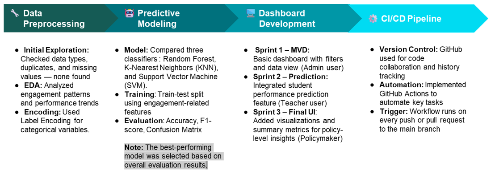
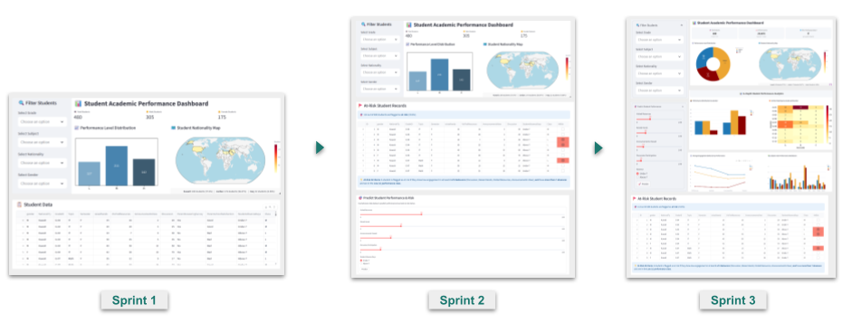

# 🎓 Student Performance Insights Through an Agile Approach

## 📌 Overview

Educational institutions generate large volumes of student data, yet transforming this information into **timely and actionable insights** remains a significant challenge. Administrators often lack a consolidated overview of performance trends, teachers struggle to identify at-risk students early, and policymakers require evidence-based insights to guide targeted interventions.

This project presents an **interactive student performance dashboard** that transforms raw academic and engagement data into meaningful insights. Developed using **Agile Data Science principles**, the solution integrates **data visualization** with **machine learning–based performance prediction**, enabling stakeholders to make informed, data-driven decisions in education.

---

## 📂 Dataset
The project uses the **Students’ Academic Performance Dataset**, which contains **480 student records with 16 demographic, academic, and engagement features** for predicting performance levels (Low, Middle, High). Features include gender, grade level, classroom activity, parent involvement, and attendance. The dataset has no missing values and is suitable for classification tasks. Explore it here: [OpenML Dataset](https://www.openml.org/search?type=data&sort=version&status=any&order=asc&exact_name=Students-Academic-Performance-Dataset&id=43415).

---

## ⚙️ Approach & Development Strategy

The dashboard is developed iteratively using an **Agile framework**, focusing on continuous feedback, stakeholder needs, and incremental value delivery. Development occurs in **three focused sprints**, each addressing a distinct user need:

### Sprint 1
- Delivers a **Minimum Viable Dashboard** with interactive filters and tabular views for data exploration.

### Sprint 2
- Integrates a **Random Forest predictive model** to classify student performance into Low, Middle, or High categories.

### Sprint 3
- Refines **usability and insight delivery** through improved visualizations, summary metrics, and confidence indicators for predictions.

The application is **deployed using Streamlit**, ensuring accessibility and ease of use for non-technical users.

---

## 🖥️ Technical Highlights

The technical process includes the following steps:

  

*Figure: Overview of the technical workflow*
---

## 📊 Dashboard Development

  
*Figure: Screenshot of the interactive dashboard*

- **MVD** - https://minminminmin98-case-study-student-dashboardmvd-dashboard-rzjomh.streamlit.app/ 
- **Predictive Model** - https://minminminmin98-cas-student-dashboardpredictive-dashboard-yoma3b.streamlit.app/  
- **Final UI** - https://minminminmin98-case--student-dashboardfinal-ui-dashboard-4idous.streamlit.app/

---

## 🧠 Key Features

- Interactive filtering by academic and demographic attributes  
- Predictive performance classification using machine learning  
- Visual summaries for trend analysis and stakeholder reporting  
- Clear distinction between administrator, teacher, and policymaker perspectives  
- Confidence indicators that enhance transparency of model predictions  

---

## 🔍 Insights & Outcomes

The Agile approach allows **early validation of features** and rapid improvement based on user feedback. By integrating **predictive analytics**, the dashboard shifts from descriptive reporting to proactive decision support:

- Teachers **identify at-risk students earlier**  
- Administrators and policymakers **gain clear visibility into performance patterns**  

Challenges in synchronizing data preprocessing, model validation, and deployment within short sprint cycles are addressed through **structured sprint planning and regular reviews**, keeping progress aligned across technical and analytical components.

---

## ✅ Conclusion

This case study demonstrates how **Agile Data Science** effectively improves educational analytics, delivering a **practical and user-centered solution**. By combining iterative development, machine learning, and interactive visualization, the project highlights the potential of **data-driven tools** to support timely, evidence-based decisions in education.
